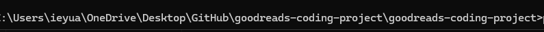
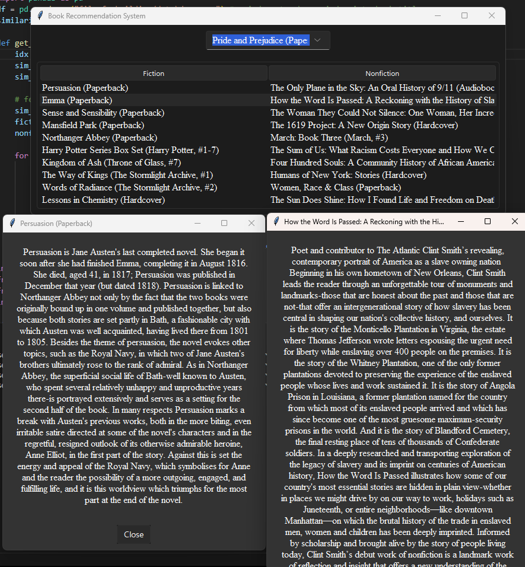

# Fiction -> Non-fiction Book Recommender (vice versa)
This is a project I made because I love fiction but don't know how to get into nonfiction. I wanted to build this system so it could recommend me non fiction books from a fiction book. I also needed projects to familiarize myself with pandas and numPy.
If you want to discuss anything you can find my contact information on my website : https://izyuan.github.io/

# Methodology
**Tech Used:** Python
To make implement this project, I webscraped for valuable data (reviews, synopsis, genres, ratings, avg ratings, etc.)
From there, I vectorized all this data and used cosine similiarity to make recommendations, so this project does not actually use an Machine Learning. 

# Instructions to run
First, you need to download Python.
from there, download these libraries by running this in your terminal. 
```
pip install numpy pandas tkinter sv_ttk
```
After that, you need to add the path to directory. You can either paste it in, or from your file explorer drag the folder into the terminal after putting in cd. Here's an example
```
cd {drag in folder}
```
or 
```
cd {path to directory}
```
It should look something like this: 


Finally, you can just run the python file by running this:
```
python .\setup.py
```
Here is what the GUI should look like 


# What I learned from this Project
-webscraping, learned how to bypass authentication requirements  
-handling and cleaning data (much harder than I thought it'd be)  
-learned somewhat about the methods of vectorizing text, and what works best with what  
-I had previously learned pandas from a book, but definetly got a lot more experienced with it 

I think eventually I'll build a website and frontend for fun

# Enjoy reading! 